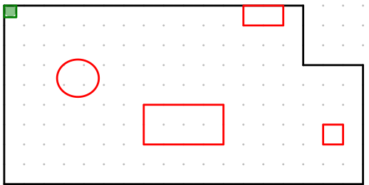

# Cleaner-One
Algorithm to find best path to cleaner your house using **Julia language**

The code above is based at inter optimization.
The place is considered a subset of points like image 


without pass inside red objects and don't leave the domain.
Restricttions

- Storage trash limitation
- batery limitation
- Region Sleepest than others
- Exists times that are minus humans at place

### Implementation
To run, install 
``` using Pkg
    Pkg.add("LinearAlgebra")
    Pkg.add("Plots")
    Pkg.add("")
```
